# Fridgemate: Stage 1 Design Report

EECS 3311 Software Design
Author: Mohammad Mashrur Mahtab Mahi
Student no. 221600234
Repository: https://github.com/mashrur5/fridgemate

## 1. Defining my agent project

## 1.1 Project Description

### 1.1.1 Problem and Motivation

I live with roommates, and we all share one fridge. It sounds simple, but it causes the same problems every week. Nobody knows what they can cook with what is already there, so we end up ordering food or buying more groceries. Items get pushed to the back, and after a few days it is hard to remember whose milk or vegetables are whose. By the time someone notices, the food has usually gone bad.

These problems come down to three things:

- Deciding what to cook: It is hard to know which meals you can make with what you have, especially when you also have to think about how much time you have and what you feel like eating.
- Losing track of ownership: In a shared fridge, food gets forgotten because no one is sure who it belongs to.
- Food waste: Without tracking expiry dates, food spoils before anyone uses it, which wastes both food and money.

Fridgemate is an AI agent that helps a shared household manage its food. It tracks what is in the fridge, freezer, and pantry, along with who owns each item. It also estimates when items will expire, reads grocery receipts, and suggests recipes and meal plans that use food before it goes bad. If one of my items is about to expire and I know I won't use it, I can offer it to my roommates instead of throwing it out (#NoWaste)!

### 1.1.2 Target Users

Fridgemate is built for students and young adults who live in shared housing, such as roommates/housemates in an apartment or house or even residence. Most of these users are busy and on a tight budget (broke college students), so throwing away food actually hurts. They also share a fridge with people they may not talk to every day, which is why ownership and sharing are a big part of the design.

### 1.1.3 What the Agent Can Do

Fridgemate has 15 features in three groups.
| Group | Features |
| --- | --- |
| Tracking food | F01 Inventory management, F02 AI storage placement, F03 Receipt import, F04 Expiry estimation and tracking, F05 Expiring-soon alerts, F06 Household members, ownership, and preferences |
| Cooking | F07 Constraint-based recipe agent, F08 Missing-ingredient detection and substitution, F09 Cook recipe, F10 Quick Recipe Finder |
| Planning and sharing | F11 Shopping list generation, F12 Natural-language fridge commands, F13 Waste-rescue meal plan, F14 Shared grocery cost split, F15 Share before it spoils |

A few examples show what this looks like in practice:

- **Recipe suggestions:-** The user picks a cuisine, a cooking time (under 15, 15 to 30, 30 to 60, or over 60 minutes), a meal weight (light, medium, or heavy), and the number of servings. Each option also has "Let AI decide." The agent then suggests recipes that use the user's own food and anything shared, starting with what expires first.
- **Receipt import:-** The user uploads a photo of a grocery receipt, and the agent turns it into a clean list of items to confirm before saving.
- **Plain-English commands:-** The user can type something like "I finished the milk, add 6 eggs," and the agent turns it into the right inventory changes.
- **Sharing before it spoils:-** When an item is about to expire, its owner can offer it to the household. Everyone else gets a notification, and the first person to claim it becomes the new owner.

Besides these 15 features, Fridgemate also has register, login, and change password, which are handled through Auth0. I don't count these as features, since the instructions say login and change password don't count, but every other feature depends on them to know who owns what. Creating a household and inviting roommates is part of F06.

### 1.1.4 Why an AI Agent Fits This Problem

Picking a meal sounds easy, but it involves a lot of things at once: what is in stock, who owns it, what is about to expire, how much time the user has, what kind of food they want, and how many people they are cooking for. A single call to an LLM cannot handle this reliably, because the model has no idea what is in my fridge and it may make up ingredients that are not there. That is why Fridgemate uses an agent that works in steps and checks its work with tools.

The agent shows the following behaviors:

- **Tool use:-** It reads the inventory, checks expiry dates, searches for recipes, and converts units by calling tools instead of guessing.
- **Multi-step planning:-** The recipe agent filters the inventory, ranks items by expiry, searches for recipes, checks them against real stock, and suggests substitutes, all in one loop. The meal plan agent plans 3 to 5 days ahead and re-plans when something changes.
- **Reasoning and decision making:-** The agent ranks recipes by balancing expiry dates, time limits, and preferences. When the user selects "Let AI decide" for an option, the agent makes that choice itself and explains why.
- **Retrieval:-** Recipes come from TheMealDB, an external recipe database, so suggestions are based on real recipes. If it doesn't have enough recipes that fit, the agent writes one itself, labels it as AI-generated, and checks it against the real stock like any other recipe.
- **Memory:-** The agent keeps the recent conversation, so a follow-up like "use that one instead" makes sense. It also remembers each member's dietary restrictions and dislikes.
- **Understanding messy input:-** It reads receipt photos where items show up as short codes like "GRN ONIO," and it understands commands written in plain English.

Not every feature needs AI, though. Splitting costs or subtracting ingredients after cooking has one correct answer, so regular code handles those. I only use the AI where judgment is actually needed.

#### 1.1.5 AI Model

Fridgemate uses *Google Gemini Flash* through the Gemini API. I chose it for three reasons: it has a free tier, it supports tool calling, and it can read images, which receipt import needs. Gemini is only ever called from the server, so the API key never reaches a user's browser. Since the free tier has rate limits, the server retries failed calls after a short wait.

All LLM calls go through one *LLMClient* interface. If Gemini ever becomes a problem, a local model run through Ollama can replace it by changing the configuration only, without touching the rest of the system.

#### 1.1.6 How the AI Interacts with the Rest of the System

Neither the LLM nor the clients ever read or change data directly. Every request goes through the same path:

1. The user does something in the web app or types a CLI command. The client sends a request to the Fridgemate server, along with the user's login token.
2. The server checks the token and finds the user's household. From then on, every step only sees that household's data.
3. The request reaches *FridgemateFacade*, the single entry point to the system. It sends regular requests, like adding an item or splitting costs, to domain services, and AI requests, like recipe suggestions or meal plans, to an agent.
4. The agent builds a prompt and calls *LLMClient*, giving the model a set of tools it can use.
5. When the model asks for a tool, the agent runs it. Tools only talk to domain services, and those services apply the ownership, household, and expiry rules.
6. The model's answer is checked against an expected format, and every recipe is checked against the real stock before it is sent back.
7. If the AI suggests a change to the inventory, the user confirms it first, and then it is carried out as a command that can be undone.

Because of this setup, rules like "never use a roommate's food" and "never suggest expired food" are enforced by regular code on the server. The system does not rely on the LLM to follow them.

#### 1.1.7 Overall Architecture

Fridgemate is a live web product with two sides. The client side is what users see: a web app that runs in any browser, including on phones, and a command-line tool. The server side does all the real work. It holds the business rules, runs the AI agents, and is the only part that talks to the database and outside services. Since the clients only send requests and show results, they stay simple, and both behave the same way.

| Side | Layer | Contains | Responsibility |
| --- | --- | --- | --- |
| Client | Presentation | React web pages, CLI commands | Take user input and show results |
| Client | Client gateway | API clients for the web app and the CLI, Auth0 login | Send requests to the server with the user's login token |
| Server | API | FastAPI routers, token verification | Check who the user is and pass the request on |
| Server | Application | `FridgemateFacade` | One entry point for every request |
| Server | Domain and Agent | Food items, services, commands, agents, tools | Business rules and AI reasoning |
| Server | Infrastructure | Neon database access, Gemini client, TheMealDB client | Storage and outside services |

Each roommate creates their own account and uses Fridgemate on their own device. Accounts are handled by Auth0. Users register with their email and password, Fridgemate asks for their name the first time they log in, and Auth0 sends an email if they need to reset their password, so passwords never reach Fridgemate at all. After logging in, a user either creates a household and gets an invite code, or joins their roommates' household with that code. The server only ever returns data from the user's own household, so different households never see each other's food.

All data is stored in one online PostgreSQL database hosted on Neon, so a change made on one device shows up on every other device. Notifications for shared items are saved there too, and the web app checks for new ones every minute. Since the server talks to the database only through repository interfaces such as *ItemRepository*, the database could be replaced later without changing the services, agents, or clients.

#### 1.1.8 Technology Stack

| Part | Choice |
| --- | --- |
| Web GUI | React with TypeScript |
| CLI | Python with typer |
| Server | Python 3.12 with FastAPI |
| Database | Neon (serverless PostgreSQL) |
| Accounts | Auth0 |
| LLM | Google Gemini Flash (Ollama as a backup) |
| Recipe data | TheMealDB |
| Hosting | Render for the server; the web app's host is chosen in nexr stage|
| Testing (Stage 3) | pytest and KUMA |

#### 1.1.9 Minimum Requirements

| Requirement | How Fridgemate meets it |
| --- | --- |
| GUI | A React web app that runs in any browser, including on phones, with pages for inventory, household, recipes, quick finder, meal plan, shopping list, cost split, notifications, and chat commands |
| CLI | A `fridgemate` command with subcommands for the same features, plus `login`, `logout`, and `change-password`. It calls the same server API as the web app |
| At least 10 features | 15 features: 6 deterministic, 4 hybrid, and 5 AI or agent |
| At least 5 design patterns | 7 patterns: Facade, Strategy, Command, Observer, State, Adapter, and Factory Method (Section 2.1) |
| AI model | Google Gemini Flash, called from the server |
| Agent behavior | Tool use, multi-step planning, reasoning, retrieval, and memory (Section 1.1.4) |

### 1.2 Feature Specification

This section specifies Fridgemate's 15 features, each using the eight fields from the instructions. Register, login, and change password are described in 1.2.16, since they don't count as features.

Two things apply to every feature, so they aren't repeated below.

**CLI access.** Every feature can also be used from the CLI:

| Features | CLI command |
| --- | --- |
| F01, F02, F04 | `fridgemate items add`, `list`, `edit`, `remove` |
| F03 | `fridgemate receipt import <photo>` |
| F05 | `fridgemate alerts` |
| F06 | `fridgemate household create`, `join`, `show`, and `fridgemate prefs set` |
| F07, F08 | `fridgemate recipes suggest --cuisine --time --weight --servings` |
| F09 | `fridgemate cook <recipe-id>` |
| F10 | `fridgemate recipes find "<ingredients>"` |
| F11 | `fridgemate shopping list`, `add`, `check` |
| F12 | `fridgemate do "<message>"` |
| F13 | `fridgemate plan --days <n>` |
| F14 | `fridgemate costs --month <yyyy-mm>` |
| F15 | `fridgemate offer <item>`, `claim <item>`, `notifications` |

**Common error cases.** These are handled the same way in every feature:
- **Server unreachable:** the app says it couldn't connect, nothing changes, and the user can try again.
- **AI unavailable or rate-limited:** the app asks the user to try again shortly, unless the feature lists a fallback below.
- **Malformed AI answer:** the server retries once, then shows an error.
- **Someone else's item:** members can only change their own items or Shared ones, so the app blocks the action.

#### 1.2.1 F01: Inventory Management

**Description:** Lets users keep track of everything in the household's fridge, freezer, and pantry. Each item stores its name, quantity, unit, location, owner, expiry date, price, and who paid for it. Every change can be undone.

**User Interaction:** The Inventory page lists all items grouped by location, with a search box and filters for location, owner, and freshness. "Add item" opens a form, each item has Edit and Remove buttons, and an Undo button appears after each change.

**Input:**
- Name and quantity (required), plus a unit from a fixed list (g, kg, ml, L, pieces)
- Location and expiry date (optional, since F02 and F04 can fill them in)
- Owner: the user, Shared, or a specific roommate (defaults to the user)
- Price and who paid (optional, used by F14)
- For searching: a text query and filters

**Output:** The updated inventory list, showing each item's location, owner, quantity, and freshness label.

**AI Involvement:** Deterministic. AI is only used through F02 and F04 when the location or expiry date is left empty.

**Expected Workflow:**
1. The user submits the form.
2. The server checks the values, such as the quantity being greater than zero.
3. A missing location or expiry date is filled in by F02 or F04.
4. The change runs as a command, is saved, and is added to the user's undo history.
5. Expiry alerts and the shopping list are told about the change.
6. The page shows the updated list.

**Error/Alternative Cases:**
- **Missing or invalid values:** the form shows an error and nothing is saved.
- **Item already gone:** a roommate removed it a moment earlier, so the app says so and refreshes the list.
- **Nothing to undo:** after a server restart, the app explains there is nothing to undo.

#### 1.2.2 F02: AI Storage Placement

**Description:** When a user adds an item without choosing a location, the AI suggests the fridge, freezer, or pantry with a short reason. The user can accept or change it, and a rule table takes over if the AI is unavailable.

**User Interaction:** In the Add Item form, Location starts on "Suggest for me." Once the name is typed, the suggestion appears with a one-line reason, such as "Freezer: ground beef keeps for months frozen." The same suggestions appear in the receipt review popup (F03).

**Input:** The item name, plus any detail the user typed, such as "frozen peas" or "opened."

**Output:** A suggested location with a short reason, and whether it came from the AI or the rule table.

**AI Involvement:** Hybrid. The LLM makes the suggestion, but the answer must be one of the three locations, the rule table is the fallback, and the user has the final say.

**Expected Workflow:**
1. The user enters an item name and leaves the location empty.
2. The server asks the LLM where the item should be stored, in a fixed answer format.
3. The answer is checked to make sure it is exactly Fridge, Freezer, or Pantry.
4. The suggestion is shown, and the item is saved with whatever location the user keeps or picks.

**Error/Alternative Cases:**
- **AI unavailable or invalid answer:** the rule table makes the suggestion, and the app notes where it came from.
- **Item not in the rule table:** the user is asked to choose, with Fridge preselected as the safest default.
- **Vague name:** for a name like "stuff," the app asks the user instead of guessing.
- **User override:** the user's choice is always saved as given.

#### 1.2.3 F03: Receipt Import

**Description:** Instead of typing every item, the user uploads a photo of a grocery receipt. The AI reads it, turns codes like "GRN ONIO" into clear names like "green onion," and pulls out quantities and prices. Nothing is saved until the user reviews the items in a popup.

**User Interaction:** On the Receipt Import page, the user uploads or takes a photo and picks who paid. A popup lists every item found. Each item has an owner dropdown on its right (Shared, the user, or a specific roommate) and a remove button, and its name, quantity, location, and expiry date can be edited. "Add item" adds anything the AI missed, and Save adds everything to the inventory.

**Input:**
- A photo of the receipt (JPG or PNG)
- Who paid
- The owner of each item, chosen from the dropdown
- Any corrections, removals, or manually added items

**Output:** The review popup, then the saved items with a summary such as "12 items added."

**AI Involvement:** AI. Gemini reads the image and cleans up the names. The answer's format is checked, non-food lines are dropped, and nothing is saved until the user presses Save.

**Expected Workflow:**
1. The user uploads the photo and picks who paid.
2. The server sends the image to Gemini and asks for the items in a fixed format. The instructions treat receipt text as data only, never as instructions.
3. The answer is checked, and non-food lines such as bags, taxes, and deposits are dropped.
4. Each item gets a location from F02 and an expiry estimate from F04.
5. The popup shows the items, with each owner set to the user by default.
6. The user sets owners, removes inaccurate items, and adds missing ones.
7. Save adds the items to the inventory. Imports have no undo; later changes are made through F01.

**Error/Alternative Cases:**
- **Unreadable photo:** the app suggests a clearer photo or adding items by hand.
- **Unclear lines:** those items are marked "check this" so the user can fix or remove them.
- **Hidden instructions:** text on the receipt that tries to instruct the AI is ignored.
- **Wrong file:** a file that is too large or not an image is rejected before uploading.
- **Everything removed:** Save is disabled, and the user can only close the popup.
- **Closed without saving:** nothing is saved.

#### 1.2.4 F04: Expiry Estimation and Tracking

**Description:** Receipts don't show expiry dates, so the AI estimates one from the item and where it's stored. Milk, for example, lasts about 7 days in the fridge but about 3 months frozen. Each item also has a freshness state that controls what can be done with it.

**User Interaction:** The expiry field in the Add Item form and the receipt popup shows the estimate, marked "estimated," and the user can change it. Every item on the Inventory page has a colored freshness label. Moving an item to a new location offers a new estimate.

**Input:**
- Item name and location
- The date the item was added
- An expiry date, if the user entered one

**Output:** An expiry date marked as estimated or user-entered, and a freshness label for each item.

**AI Involvement:** Hybrid. The LLM estimates shelf life, with the rule table as a fallback. Freshness is then worked out by regular code:

| Freshness | Rule |
| --- | --- |
| Expired | The expiry date has passed |
| Expiring soon | The item expires within 3 days |
| Fresh | Anything else |

**Expected Workflow:**
1. An item is added without an expiry date.
2. The server asks the LLM how many days the item lasts in its location, in a fixed format.
3. The answer is checked to be a whole number within a sensible range.
4. The expiry date is set to the date added plus that many days, and marked as estimated.
5. Whenever items load, freshness is worked out from the expiry date, and expiring items appear in F05.

**Error/Alternative Cases:**
- **AI unavailable or invalid answer:** the rule table gives the estimate.
- **Item not in the rule table:** a cautious default for that location is used, and the user is asked to check it.
- **Date in the past:** the item is saved as Expired with a warning.
- **Item moved:** a new estimate is offered, but the user can keep the old date.
- **User-entered dates:** a date the user typed is never replaced by an AI estimate.

#### 1.2.5 F05: Expiring-Soon Alerts and "Use It First" View

**Description:** Shows the user which of their own and Shared items are expiring soon, most urgent first, so nothing gets forgotten. Expired items are listed separately, and each expiring item can be offered to the household through F15.

**User Interaction:** After login, a banner shows how many items expire soon, such as "3 items expire in the next 3 days." It opens the "Use it first" tab on the Inventory page, which lists those items with days left, location, and owner. Expiring items have an "Offer to household" button, and expired items have a Remove button.

**Input:** Nothing typed. The feature uses the user's own and Shared items, their expiry dates, and today's date.

**Output:** A banner with the number of items expiring soon, a list of expiring items sorted soonest first, and a separate list of expired items.

**AI Involvement:** Deterministic.

**Expected Workflow:**
1. The user opens the app, or the inventory changes.
2. The server loads the household's items and works out each item's freshness.
3. The alert list updates automatically whenever the inventory changes.
4. The list is narrowed to the user's own and Shared items and sorted by days left.
5. The banner and the "Use it first" tab show the result.

**Error/Alternative Cases:**
- **Nothing expiring:** the tab says "Nothing is expiring soon," and no banner appears.
- **Expired items:** they can't be offered, so they get a Remove button instead.
- **Roommates' items:** they never appear in another member's alerts.

#### 1.2.6 F06: Household Members, Ownership, and Preferences

**Description:** Sets up the household and tracks who owns what. On first login, a user creates a household and gets an invite code, or joins one with a roommate's code. Members also save dietary restrictions and dislikes, which every AI feature respects.

**User Interaction:** After registering, the user enters their name and chooses "Create a household" or "Join with a code." The Household page shows the members, the invite code with a copy button, and a "My preferences" section for ticking restrictions (vegetarian, vegan, halal, gluten-free, dairy-free, nut-free) and typing disliked ingredients. The Inventory page has an owner filter.

**Input:**
- The user's name
- A household name when creating, or an invite code when joining
- Dietary restrictions and disliked ingredients
- An owner to filter by

**Output:** A household with its members and invite code, saved preferences, and a filtered inventory list.

**AI Involvement:** Deterministic. The preferences are used by F07, F10, and F13.

**Expected Workflow:**
1. On first login, the user enters their name.
2. Creating makes a household with a unique random invite code; joining finds the household by its code and adds the user.
3. The user lands on their household's Inventory page.
4. Saved preferences are used by every AI feature from then on.
5. Picking an owner filter shows only that owner's items.

**Error/Alternative Cases:**
- **Wrong invite code:** the app says no household was found.
- **Already in a household:** each member belongs to one household, and switching isn't supported in this version.
- **Guessing codes:** invite codes are long and random, so they can't realistically be guessed.
- **Unusual disliked ingredient:** it's saved as typed, and the AI avoids it.

#### 1.2.7 F07: Constraint-Based Recipe Agent

**Description:** Fridgemate's main AI agent. The user picks what kind of meal they want, and the agent finds recipes that fit and can be made with the food they actually have. It never uses a roommate's food or anything expired, and it favors items expiring soon or offered by roommates.

**User Interaction:** On the Recipes page, the user picks four options, each of which also has "Let AI decide":

| Option | Choices |
| --- | --- |
| Cuisine | A list from the recipe database, such as Italian, Indian, or Chinese |
| Cooking time | Under 15, 15 to 30, 30 to 60, or over 60 minutes |
| Meal weight | Light, Medium, or Heavy |
| Servings | 1 to 10 |

"Get recipes" shows up to 5 cards with the name, cuisine, estimated time and weight, the fridge items used (expiring ones highlighted), and missing ingredients. Recipes written by the AI are labeled "AI-generated." Each card has "Why this recipe?", "Cook this" (F09), and "Add missing to shopping list" (F11) buttons.

**Input:**
- The four option choices
- The user's own and Shared items, gathered automatically
- The user's dietary restrictions and dislikes

**Output:** Up to 5 ranked recipes, each with estimated time and weight, the items used, missing ingredients, and an explanation. For any "Let AI decide" option, the explanation says what the AI chose and why.

**AI Involvement:** AI agent. It works in several steps, using tools for the inventory, recipe search, and stock check. Ownership and expiry rules are applied by regular code before the LLM sees any items. The recipe database has no cooking times or meal weights, so the AI estimates both and the app labels them as estimates.

**Expected Workflow:**
1. The user picks the options and presses "Get recipes."
2. The agent collects the user's usable items, with roommates' and expired items filtered out by regular code.
3. The items are ranked by urgency, with expiring and offered items first.
4. The agent searches the recipe database using the most urgent ingredients, one at a time and within the chosen cuisine, and merges the results.
5. The LLM estimates time and weight, drops recipes that don't fit the options or preferences, and makes a choice for any "Let AI decide" option.
6. Each recipe is checked against the real stock, and missing ingredients go to F08.
7. If too few recipes fit, the agent writes one, labels it AI-generated, and checks it the same way.
8. The recipes are ranked by expiring items used, fewest missing ingredients, and fit, and the top results are shown with explanations.

**Error/Alternative Cases:**
- **No usable ingredients:** the agent suggests the Quick Finder (F10) or the shopping list (F11).
- **No recipe fits every option:** the closest matches are shown with a clear note of which option couldn't be met, such as "Nothing fits under 15 minutes." An option is never ignored silently.
- **Recipe database unavailable:** only AI-generated recipes are used, labeled and checked against the stock.
- **Step limit reached:** the agent stops after 6 tool steps and returns what it found, with a note.
- **Preference conflict:** recipes with a restricted or disliked ingredient are removed, even if they match everything else.

#### 1.2.8 F08: Missing-Ingredient Detection and Substitution

**Description:** For every suggested recipe, checks which ingredients the user has, has too little of, or is missing. It suggests substitutes from what they already have, such as yogurt instead of sour cream, and anything else can go on the shopping list.

**User Interaction:** Each recipe card from F07 or F10 has a "You have" and a "Missing" section. Missing ingredients show a suggestion like "Use yogurt instead?" with an Accept button, plus "Add to shopping list."

**Input:**
- The recipe's ingredients and amounts
- The user's usable stock (own and Shared items that aren't expired)
- The user's dietary restrictions and dislikes

**Output:** Each ingredient marked as available, short, or missing, with substitutes for missing ones.

**AI Involvement:** Hybrid. Finding what's missing is deterministic. Substitutes come from the LLM, and each one is checked by regular code.

**Expected Workflow:**
1. The agent passes a candidate recipe to the stock check.
2. Each ingredient is matched to the user's items, units are converted, and amounts are compared.
3. Short and missing ingredients are marked.
4. The LLM suggests substitutes, choosing only from the user's usable items.
5. Each substitute is checked: in stock, not expired, not a roommate's, and allowed by the user's preferences.
6. The results appear on the recipe card.

**Error/Alternative Cases:**
- **Units that can't be converted:** for amounts like "a pinch," the ingredient is marked "check amount" instead of missing.
- **Different names for the same thing:** names like "scallion" and "green onion" are matched through a small synonym list; otherwise the ingredient shows as missing.
- **No good substitute:** the app says so and offers the shopping list button.
- **Invalid suggestion:** a substitute the user doesn't have is dropped and never shown.

#### 1.2.9 F09: Cook Recipe

**Description:** When the user cooks a recipe, the ingredients used are subtracted from the inventory, with units converted where needed (2 cloves from 1 bulb of garlic). Leftovers become a new item with their own expiry date, and cooking can be undone.

**User Interaction:** "Cook this" on a recipe card opens a confirmation screen showing each ingredient, the amount taken, and which item it comes from. The user can adjust amounts and turn on "Any leftovers?" to set the number of portions and their location. After confirming, an Undo button appears.

**Input:**
- The recipe and number of servings
- The amount used of each ingredient (defaults to the recipe's amounts)
- Leftovers (optional): portions and location

**Output:** Updated quantities, used-up items removed, any leftovers added as a new item owned by the user, and a short summary.

**AI Involvement:** Deterministic. The only AI involved is F04's expiry estimate for leftovers.

**Expected Workflow:**
1. The user presses "Cook this" and reviews the amounts.
2. The server checks that every item still exists and has enough left.
3. The amounts are subtracted with units converted, and items that reach zero are removed.
4. Leftovers are added as a new item with an expiry estimate from F04.
5. The whole action is saved as one command in the undo history, and the alerts and shopping list are updated.
6. The summary is shown with an Undo button.

**Error/Alternative Cases:**
- **Not enough stock:** something changed since the recipe was suggested, so the app shows which items are short and the user can adjust or cancel.
- **Units that can't be converted:** the user enters the amount in the item's own unit.
- **Item removed:** a roommate removed an item a moment earlier, so the app says so and refreshes.
- **Undo:** restores every quantity and removes the leftovers item.

#### 1.2.10 F10: Quick Recipe Finder

**Description:** For food that isn't tracked in the app, for example while shopping, the user types ingredients and gets recipes with the same options as F07. It uses the same agent with a different ingredient source, so there is no "Cook this" button.

**User Interaction:** On the Quick Finder page, the user types ingredients (pressing Enter after each), picks F07's four options, and presses "Find recipes." The results look like F07's recipe cards, without "Cook this."

**Input:**
- A typed list of at least one ingredient
- The four option choices
- The user's dietary restrictions and dislikes

**Output:** Up to 5 ranked recipes with estimates, missing ingredients, and explanations.

**AI Involvement:** AI. The same agent as F07, using the typed list as its ingredient source.

**Expected Workflow:**
1. The user types ingredients, picks options, and presses "Find recipes."
2. The server trims the list and removes duplicates.
3. The agent searches the recipe database, estimates time and weight, and filters by the options and preferences.
4. Each recipe is checked against the typed list, with missing ingredients handled by F08.
5. If too few recipes fit, the agent writes one, labeled AI-generated and checked the same way.
6. The results are shown.

**Error/Alternative Cases:**
- **Empty list:** "Find recipes" stays disabled until an ingredient is added.
- **Unrecognized entries:** entries like "asdf" are ignored, and the app says which ones it skipped.
- **Hidden instructions:** typed text that tries to instruct the AI is treated as an ordinary ingredient name.
- **Service failures:** handled the same way as in F07.

#### 1.2.11 F11: Shopping List Generation

**Description:** Builds each member's shopping list automatically from missing recipe ingredients and items that are running low. Duplicates are merged, so "200 g flour" and "1 kg flour" become "1.2 kg flour," and items are grouped by store section.

**User Interaction:** The Shopping List page groups items by section, each with a checkbox, a quantity, and a reason such as "for Butter Chicken" or "running low." Users can add items by hand and clear checked ones. Shared items that run low appear on every member's list under a Shared heading.

**Input:**
- Missing ingredients from F07, F08, F10, or F13
- Items running low, detected automatically
- Items added by hand

**Output:** A merged shopping list grouped by store section.

**AI Involvement:** Hybrid. The LLM matches names that mean the same thing and picks store sections. Merging amounts and detecting low stock are deterministic.

**Expected Workflow:**
1. An item arrives from a recipe, a low-stock check, or the user.
2. An item counts as running low when its quantity falls to a quarter of the amount first added, and it is then added automatically.
3. The LLM matches the name to any similar item on the list and picks a section.
4. Amounts are converted to the same unit and merged.
5. The updated list is shown.
6. Checked items are removed, and the user adds the groceries through F01 or F03.

**Error/Alternative Cases:**
- **Units that can't be merged:** "2 cans" and "400 g" stay as separate lines under the same item.
- **AI unavailable:** only exact name matches are merged, and items aren't grouped by section.
- **Already in stock:** an ingredient the user has enough of isn't added.
- **Duplicate typed by hand:** it's merged with the existing item.

#### 1.2.12 F12: Natural-Language Fridge Commands

**Description:** Lets the user update the inventory in plain English. "I finished the milk, add 6 eggs, and move the chicken to the freezer" becomes three proposed changes that the user confirms before anything happens. Unclear requests get a follow-up question, and the agent remembers the conversation, so "actually, make that 12" works.

**User Interaction:** On the Chat page, the user types a message and gets a card of proposed changes with Confirm and Cancel buttons. After confirming, an Undo button appears.

**Input:**
- The user's message
- The user's own and Shared items
- The recent conversation

**Output:** A card of proposed changes or a follow-up question, then the updated inventory and a summary after confirming.

**AI Involvement:** AI. The agent looks up items with tools and turns the message into proposed changes, and every change is checked by regular code before it's shown.

**Expected Workflow:**
1. The user types a message.
2. The agent looks up the items the message mentions, using a tool.
3. The LLM turns the message into proposed changes in a fixed format.
4. Each change is checked: the item exists, the user may change it, the quantity is valid, and the unit is supported.
5. The proposed changes are shown on a card.
6. On confirm, each change runs as a command and is added to the undo history.
7. The conversation is saved, so follow-up messages can refer to earlier ones.

**Error/Alternative Cases:**
- **Unclear item:** "the milk" matches two items, so the agent asks which one.
- **Roommate's item:** the agent explains it can't change someone else's item and leaves that change out.
- **Unsupported request:** for something like "order a pizza," the agent explains what it can do.
- **Invalid quantity:** for "add -3 eggs," the agent asks the user to correct it.
- **Partly understood:** the agent proposes what it understood and asks about the rest.
- **Cancel:** nothing changes.

#### 1.2.13 F13: Waste-Rescue Meal Plan

**Description:** Plans the next 3 to 5 days of meals so food gets used before it expires. Each expiring item is assigned to a day before its expiry date, no dish repeats, and the whole plan is checked against the stock so nothing is counted twice. If something changes later, the plan can be re-planned.

**User Interaction:** On the Meal Plan page, the user picks the number of days (3, 4, or 5), meals per day (1 or 2), and the maximum cooking time, then presses "Plan my meals." The plan shows as a calendar of meal cards with the items each one uses, plus "Cook this" (F09) and "Swap" buttons. An outdated plan shows a banner with a "Re-plan" button.

**Input:**
- The number of days, meals per day, and maximum cooking time
- The user's usable items and preferences
- The existing plan, when re-planning

**Output:** A saved meal plan with a recipe for each meal, a list of missing ingredients, and a short explanation for each day.

**AI Involvement:** AI agent. It plans across several days, uses tools for the inventory and recipe search, and re-plans when something conflicts.

**Expected Workflow:**
1. The user picks the options and presses "Plan my meals."
2. The agent collects the user's usable items and sorts them by expiry date.
3. Each expiring item is assigned to a day before it expires.
4. The agent searches for recipes using each day's items and estimates their cooking times.
5. The plan is checked so the total amounts fit the stock and no dish repeats. If a check fails, only the affected days are re-planned.
6. The plan is saved and shown.
7. Each time the plan is opened, it's checked against the current stock. If something no longer fits, the banner appears, and "Re-plan" changes only the affected meals.

**Error/Alternative Cases:**
- **Not enough food:** the agent plans what it can, says which days are missing, and offers the shopping list.
- **Not enough different recipes:** the agent writes new ones, labeled AI-generated and checked against the stock.
- **Service failure partway:** the agent returns the days it planned and says which are missing.
- **Step limit reached:** the agent returns its best partial plan with a note.
- **Item expires before its day:** the plan is marked as needing an update.

#### 1.2.14 F14: Shared Grocery Cost Split

**Description:** Splits the cost of Shared items equally among household members, shows who owes whom, and works out the fewest payments needed to settle up. Items offered through F15 are free and aren't counted.

**User Interaction:** On the Cost Split page, the user picks a period (the current month by default). The page shows Shared purchases with the item, price, payer, and date, then each member's amount paid, share, and balance. Suggested payments such as "Sam pays you $12.40" each have a "Mark as paid" button.

**Input:**
- Shared items with a price and payer in the chosen period
- The household's members
- Payments already marked as paid

**Output:** Each member's balance and a short list of suggested payments.

**AI Involvement:** Deterministic.

**Expected Workflow:**
1. The user opens the page and picks a period.
2. The server collects Shared items with a price in that period, leaving out items offered through F15.
3. Each item's cost is split equally among the household's current members.
4. Each member's balance is what they paid minus their share, adjusted for payments already made.
5. The fewest payments are found by matching the member who owes the most with the member owed the most, and repeating until everyone is settled.
6. The result is shown, and "Mark as paid" records a payment and recalculates.

**Error/Alternative Cases:**
- **Missing price or payer:** the item is listed under "Missing price" with an Edit link and left out until it's fixed.
- **Only one member:** the page says there's nothing to split.
- **Rounding:** extra cents go to the payer, so the totals always match.
- **Marked by mistake:** a recorded payment can be removed, and balances are recalculated.

#### 1.2.15 F15: Share Before It Spoils

**Description:** Turns food that would be wasted into food a roommate can use. The owner of an expiring item offers it to the household, everyone else is notified, and the first roommate to claim it becomes the new owner. Offered items are free, so they're left out of the cost split.

**User Interaction:** Expiring items have an "Offer to household" button in the "Use it first" tab and in the item's details, with an optional note like "half a bag left." Other members get a notification under the bell icon, and the item shows "Offered by Alex, expires in 2 days" with a Claim button. The owner can withdraw the offer until it's claimed.

**Input:**
- The item being offered, plus an optional note
- A roommate's claim

**Output:** The item's new status, notifications for the other members, and after a claim, the new owner. The person who offered it is told who claimed it.

**AI Involvement:** Deterministic.

**Expected Workflow:**
1. The owner presses "Offer to household."
2. The server checks that the user owns the item and that it's in the Expiring soon state.
3. The item is marked as Shared and offered, as a command.
4. A notification is created for every other member.
5. The other members see it within a minute.
6. A claim is a single database update that only succeeds if the item is still unclaimed, and the claimer becomes the owner.
7. The person who offered the item is notified, such as "Sam claimed your spinach."

**Error/Alternative Cases:**
- **Not expiring soon:** the Offer button is disabled, with a note that items can be offered within 3 days of expiry.
- **Already expired:** the item can't be offered.
- **Two claims at once:** the first wins, and the second person sees "Already claimed by Sam."
- **Withdraw after a claim:** not possible, since claims are final. The new owner can offer it again.
- **Expires while offered:** the offer closes, the notification is removed, and the item shows as Expired.
- **No roommates:** offering is disabled.

#### 1.2.16 Supporting Functionality: Accounts (not counted as a feature)

The instructions say login and change password don't count as features, so these are listed separately. All of them are handled by Auth0, so Fridgemate never sees or stores passwords.

- **Register:** the user signs up with email and password on Auth0's page and confirms their email. On first login, Fridgemate asks for their name, then for a household (F06).
- **Log in and log out:** the web app sends the user to Auth0's login page and back. The CLI uses `fridgemate login`, which shows a short code to confirm in the browser.
- **Change password:** "Change password" on the Household page, or `fridgemate change-password`, makes Auth0 email a reset link.

**Error/Alternative Cases:**
- **Wrong email or password:** Auth0 shows an error without revealing which one was wrong.
- **Email already registered:** Auth0 asks the user to log in instead.
- **Session expired:** the user is sent back to the login page, and nothing saved is lost.

## 2. Designing the system using UML

### 2.1 Class Diagram

#### 2.1.1 Class Diagrams

Fridgemate has over 100 classes, so the class diagram is split into seven parts. Diagram 1 shows the overall structure, and Diagrams 2 to 7 each cover one layer. A class from another diagram appears as a small box labeled "see Diagram N." All names match the code exactly, and the source files are in `docs/stage1/diagrams/`.

##### Diagram 1: Overview

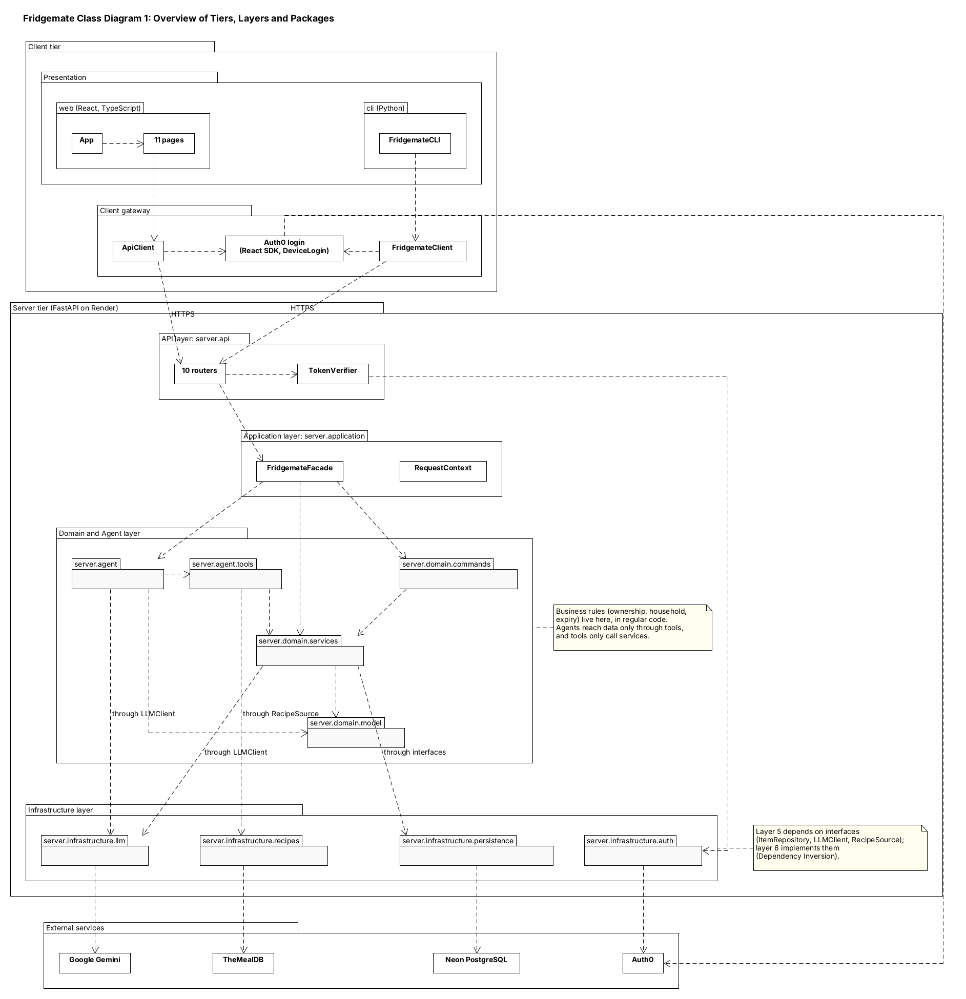

The web app and CLI send requests over HTTPS to the server, which has four layers: API, application, domain and agent, and infrastructure. Calls only go downward, and the domain layer depends on interfaces that the infrastructure layer implements.

##### Diagram 2: Clients, API and Facade

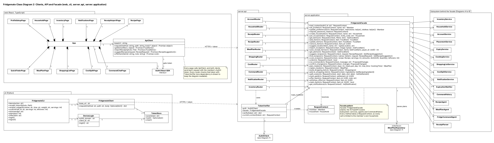

Both clients send requests with the user's Auth0 token. `TokenVerifier` checks the token and builds a `RequestContext`, and every router then calls `FridgemateFacade`.

##### Diagram 3: Domain Model and State

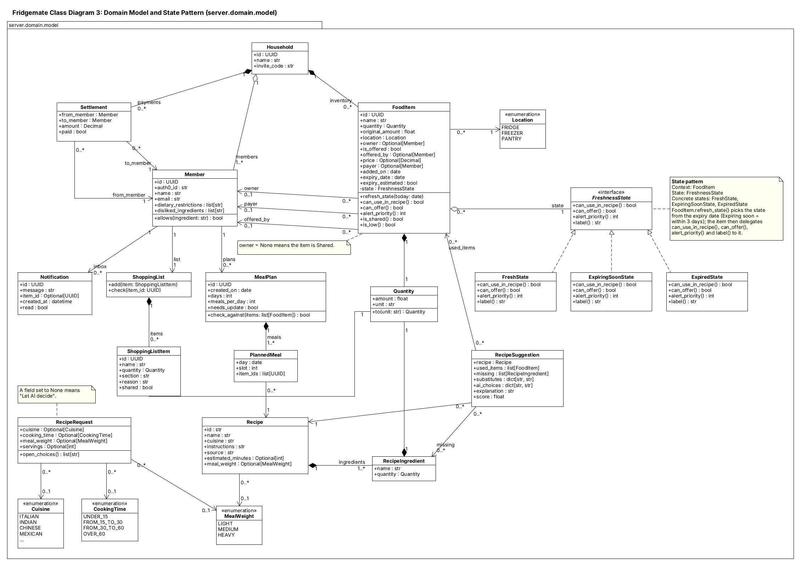

A `Household` has members and owns its `FoodItem`s. An item with no owner is Shared. Each item holds a `FreshnessState` that decides what the item is allowed to do.

##### Diagram 4: Services, Observer and Strategy

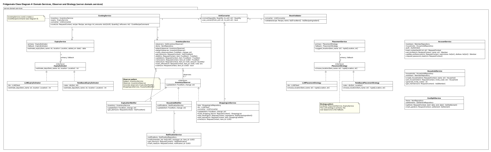

`InventoryService` notifies its observers whenever the inventory changes. `PlacementService` and `ExpiryService` use the LLM first and fall back to a rule table.

##### Diagram 5: Commands

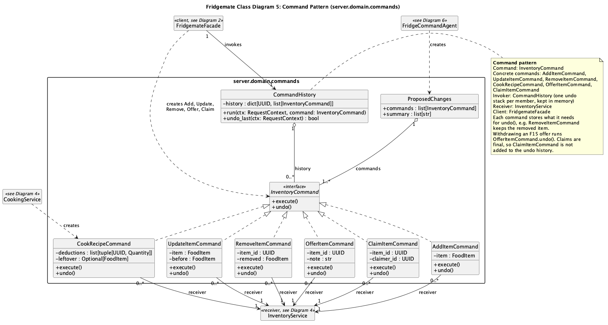

Every inventory change is a command with `execute()` and `undo()`. `CommandHistory` runs them and keeps an undo stack for each member.

##### Diagram 6: Agents and Tools

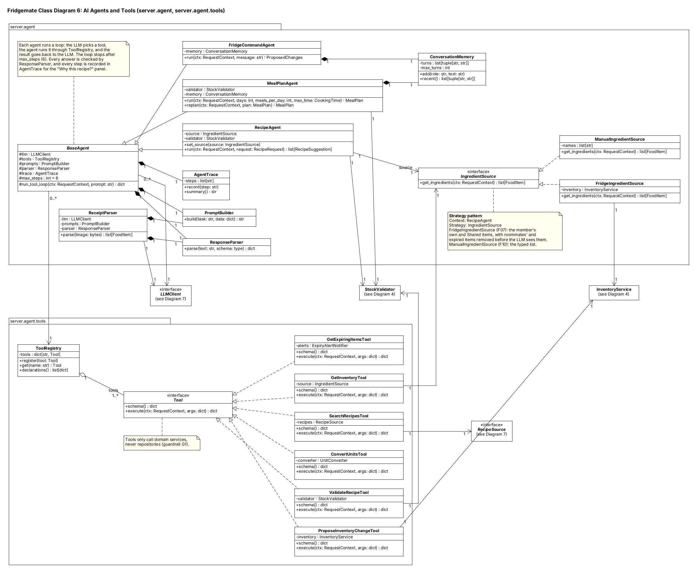

The three agents share `BaseAgent`, which runs the tool loop. Agents reach data only through tools, and tools only call services, so the ownership and expiry rules can't be skipped.

##### Diagram 7: Infrastructure

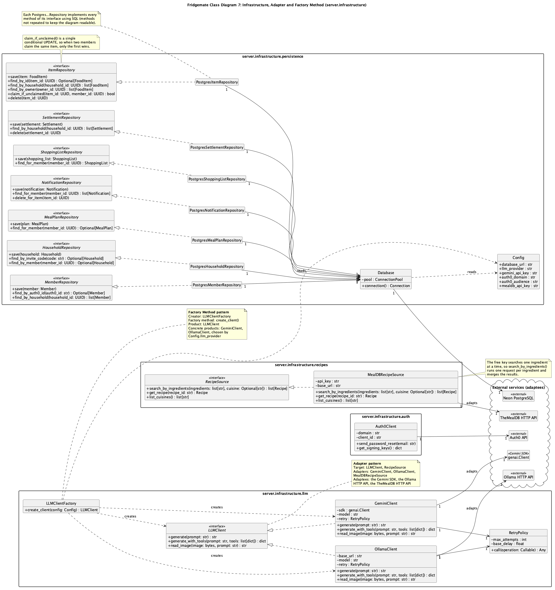

Adapters connect Fridgemate to Gemini, Ollama, and TheMealDB. `LLMClientFactory` picks the LLM, and each repository stores its data in Neon.

#### 2.1.2 Design Patterns

| Pattern | Problem it solves | Classes and roles | Why it fits | Without it |
| --- | --- | --- | --- | --- |
| **Facade** (Diagram 2) | About 30 operations are spread across 10 services, 4 agents, and the command history. | Facade: `FridgemateFacade`. Clients: the 10 routers. Subsystem: the services and agents. | Each router makes one call instead of combining several classes, like `CarEngineFacade`. | Every router would depend on most of the server, and one change would mean editing many routes. |
| **Strategy** (Diagrams 4, 6) | The same job must be done in different ways: ingredients from the fridge or a typed list, and AI estimates with a rule-based fallback. | Strategies: `IngredientSource`, `PlacementStrategy`, `ExpiryEstimator` and their implementations. Contexts: `RecipeAgent`, `PlacementService`, `ExpiryService`. | F07 and F10 run the same agent with a different source, and a fallback is just a strategy swap. | The agent and services would fill up with if/else branches, and tests couldn't swap in fakes. |
| **Command** (Diagram 5) | Inventory changes come from forms, cooking, chat, and sharing, and must be undoable. F12 must show changes before applying them. | Command: `InventoryCommand` and 6 concrete commands. Invoker: `CommandHistory`. Receiver: `InventoryService`. Client: `FridgemateFacade`. | Each change becomes an object that can be shown, run, and undone the same way, like Waiter, Order, and Chef. | Every feature would need its own undo logic, and F12 would need a separate preview format. |
| **Observer** (Diagram 4) | Alerts, the shopping list, and notifications must react to inventory changes. | Subject: `InventoryService`. Observer: `InventoryObserver`. Concrete observers: `ExpiryAlertNotifier`, `ShoppingListService`, `HouseholdNotifier`. | One change has several independent reactions, like ClockTimer and its clocks. | `InventoryService` would call every feature directly, breaking the Open-Closed Principle. |
| **State** (Diagram 3) | An item's allowed actions depend on freshness: expired items can't be used or offered. | Context: `FoodItem`. State: `FreshnessState`. Concrete states: `FreshState`, `ExpiringSoonState`, `ExpiredState`. | The behavior changes with the state, and a new state only needs one new class. | Date checks would be repeated across features, and one mistake could let the agent suggest expired food. |
| **Adapter** (Diagram 7) | Gemini, Ollama, and TheMealDB each have their own API. | Targets: `LLMClient`, `RecipeSource`. Adapters: `GeminiClient`, `OllamaClient`, `MealDBRecipeSource`. Adaptees: the outside APIs. | The agents use one interface, and the adapter hides service limits, like the round and square pegs. | Service-specific code would spread through the agents, and switching LLMs would mean rewriting them. |
| **Factory Method** (Diagram 7) | The LLM is chosen by configuration, so callers shouldn't name a client class. | Creator: `LLMClientFactory` with `create_client()`. Product: `LLMClient`. Concrete products: `GeminiClient`, `OllamaClient`. | The choice sits in one place, like NameFactory, and completes the Dependency Inversion setup. | The same provider check would be repeated everywhere an LLM is created. |

### 2.2 Use-Case Diagram and Descriptions

#### 2.2.1 Use-Case Diagram

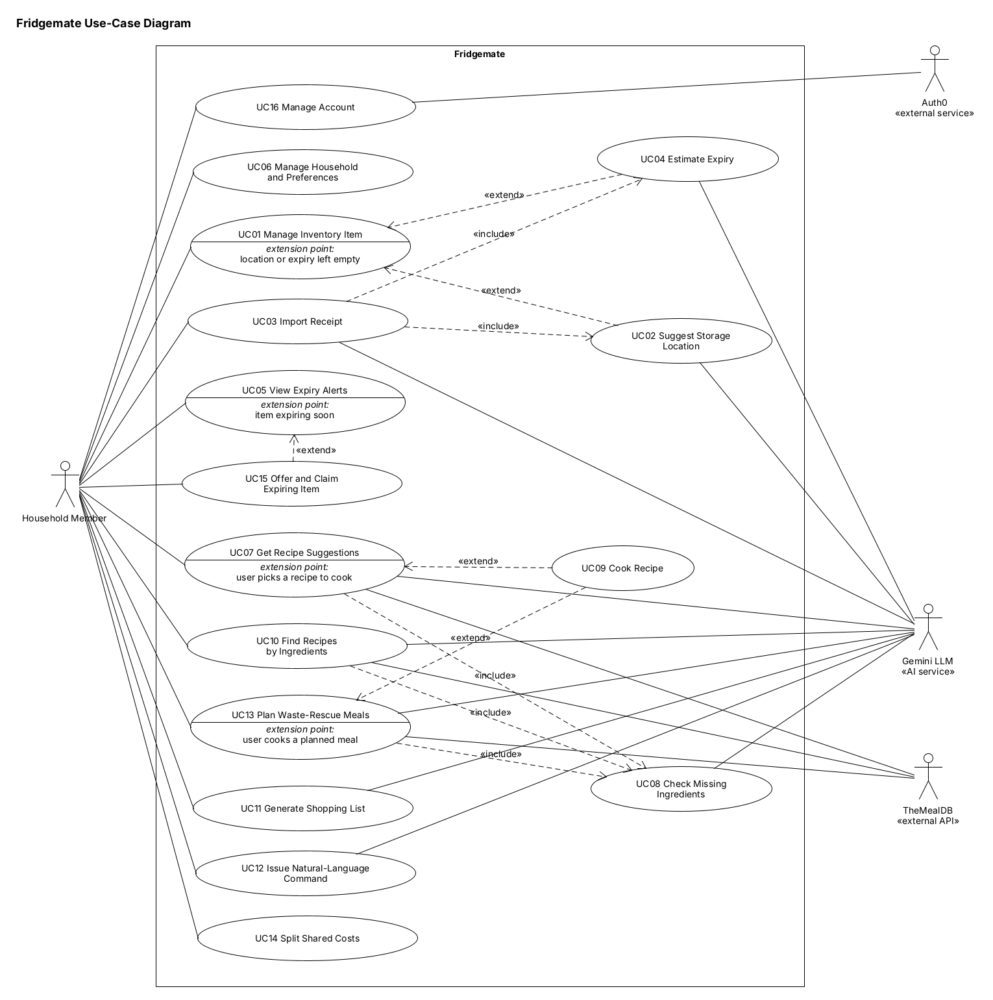

The diagram shows everything a household member can do with Fridgemate and which outside services help. It follows the notation from the course slides:

| Symbol | Meaning |
| --- | --- |
| Stick figure | An actor: someone or something outside the system that interacts with it |
| Oval | A use case: one goal an actor can reach with the system |
| Rectangle | The system boundary; everything inside is part of Fridgemate |
| Solid line | An actor takes part in a use case |
| Dashed arrow labeled «include» | The base use case always uses the included one, so its steps are written once instead of copied |
| Dashed arrow labeled «extend» | Optional behavior added to a base use case at the extension point written inside its oval |

**Actors:**

| Actor | Type | Role |
| --- | --- | --- |
| Household Member | Primary user | Uses every feature. The same actor plays the owner who offers an item and the roommate who claims it in UC15. |
| Gemini LLM | AI service | Reads receipts, estimates locations and expiry dates, and powers the recipe, meal plan, and chat agents |
| TheMealDB | External API | Supplies real recipes for UC07, UC10, and UC13 |
| Auth0 | External service | Handles registration, login, and password resets |

There is no administrator, since each member manages their own items and the household manages itself.

Logging in (UC16) is a precondition of every other use case instead of an «include». A member logs in once per session, not once per action, so drawing an «include» from all 15 use cases would add clutter without adding meaning.

#### 2.2.2 Use-Case Descriptions

##### UC01: Manage Inventory Item

| Field | Description |
| --- | --- |
| **Use Case ID** | UC01 |
| **Use Case Name** | Manage Inventory Item |
| **Actor(s)** | Household Member |
| **Goal** | Keep the household's inventory accurate by adding, editing, or removing items. |
| **Preconditions** | The member is logged in and belongs to a household. |
| **Trigger** | The member presses "Add item," Edit, or Remove on the Inventory page. |
| **Main Success Scenario** | 1. The member fills in the item details and submits them. 2. The system checks the values. 3. If the location or expiry date is empty, the system runs UC02 or UC04 at the extension point. 4. The system saves the change as an undoable command. 5. The system updates the expiry alerts and the shopping list. 6. The system shows the updated list with an Undo button. |
| **Alternative/Exception Flows** | 2a. A value is missing or invalid: the system shows an error and saves nothing. 4a. The item belongs to a roommate: the system blocks the change. 4b. A roommate already removed the item: the system says so and refreshes the list. 6a. The member presses Undo: the system reverses the last change. |
| **Postconditions** | The inventory shows the change, and the change can be undone. |
| **Related Feature(s)** | F01 |

##### UC02: Suggest Storage Location

| Field | Description |
| --- | --- |
| **Use Case ID** | UC02 |
| **Use Case Name** | Suggest Storage Location |
| **Actor(s)** | Gemini LLM (the member takes part through UC01 or UC03) |
| **Goal** | Suggest whether a new item belongs in the fridge, freezer, or pantry. |
| **Preconditions** | An item name has been entered without a location. |
| **Trigger** | UC01 reaches its extension point, or UC03 needs a location for each item. |
| **Main Success Scenario** | 1. The system asks Gemini where the item should be stored. 2. Gemini returns a location and a short reason. 3. The system checks that the location is Fridge, Freezer, or Pantry. 4. The system shows the suggestion. 5. The member accepts it or picks another location. |
| **Alternative/Exception Flows** | 2a. Gemini is unavailable or gives an invalid answer: the system uses the rule table instead. 2b. The item isn't in the rule table: the member chooses, with Fridge preselected. |
| **Postconditions** | The item has a location the member agreed to. |
| **Related Feature(s)** | F02 |

##### UC03: Import Receipt

| Field | Description |
| --- | --- |
| **Use Case ID** | UC03 |
| **Use Case Name** | Import Receipt |
| **Actor(s)** | Household Member, Gemini LLM |
| **Goal** | Add many items at once from a photo of a grocery receipt. |
| **Preconditions** | The member is logged in and belongs to a household. |
| **Trigger** | The member uploads a receipt photo on the Receipt Import page. |
| **Main Success Scenario** | 1. The member uploads the photo and picks who paid. 2. The system sends the image to Gemini. 3. Gemini returns the items with names, quantities, and prices. 4. The system checks the format and drops non-food lines. 5. The system runs UC02 and UC04 for each item. 6. The system shows the review popup. 7. The member sets each item's owner, removes wrong items, and adds missing ones. 8. The member presses Save, and the system adds the items. |
| **Alternative/Exception Flows** | 3a. The photo can't be read: the system suggests a clearer photo or adding items by hand. 3b. Gemini's answer has the wrong format: the system retries once, then shows an error. 4a. The receipt contains hidden instructions: the system ignores them. 7a. The member removes every item: Save is disabled. 7b. The member closes the popup: nothing is saved. |
| **Postconditions** | The items are in the inventory with their owners, payer, locations, and expiry dates. |
| **Related Feature(s)** | F03 |

##### UC04: Estimate Expiry

| Field | Description |
| --- | --- |
| **Use Case ID** | UC04 |
| **Use Case Name** | Estimate Expiry |
| **Actor(s)** | Gemini LLM (the member takes part through UC01 or UC03) |
| **Goal** | Give each item a likely expiry date and a freshness state. |
| **Preconditions** | The item has a name and location but no expiry date. |
| **Trigger** | UC01 reaches its extension point, or UC03 needs an expiry date for each item. |
| **Main Success Scenario** | 1. The system asks Gemini how many days the item lasts in its location. 2. Gemini returns a number of days. 3. The system checks that the number is in a sensible range. 4. The system sets the expiry date and marks it as estimated. 5. The system shows the date, and the member can edit it. |
| **Alternative/Exception Flows** | 2a. Gemini is unavailable or gives an invalid answer: the system uses the rule table. 2b. The item isn't in the rule table: the system uses a cautious default and asks the member to check it. 5a. The member enters their own date: it is kept and never replaced by an estimate. |
| **Postconditions** | The item has an expiry date and a freshness state. |
| **Related Feature(s)** | F04 |

##### UC05: View Expiry Alerts

| Field | Description |
| --- | --- |
| **Use Case ID** | UC05 |
| **Use Case Name** | View Expiry Alerts |
| **Actor(s)** | Household Member |
| **Goal** | See which items should be used first. |
| **Preconditions** | The member is logged in and belongs to a household. |
| **Trigger** | The member logs in or opens the "Use it first" tab. |
| **Main Success Scenario** | 1. The member opens the app. 2. The system loads the member's own and Shared items and works out their freshness. 3. The system shows a banner with the number of items expiring soon. 4. The member opens the "Use it first" tab. 5. The system lists expiring items with the soonest first, and expired items separately. |
| **Alternative/Exception Flows** | 2a. Nothing is expiring: the system says so and shows no banner. 5a. The member wants to offer an expiring item: UC15 runs at the extension point. 5b. The member removes an expired item: UC01 handles the removal. |
| **Postconditions** | The member knows which items to use first. |
| **Related Feature(s)** | F05 |

##### UC06: Manage Household and Preferences

| Field | Description |
| --- | --- |
| **Use Case ID** | UC06 |
| **Use Case Name** | Manage Household and Preferences |
| **Actor(s)** | Household Member |
| **Goal** | Create or join a household and save dietary preferences. |
| **Preconditions** | The member is logged in (UC16). |
| **Trigger** | The member logs in for the first time, or opens the Household page. |
| **Main Success Scenario** | 1. On first login, the system asks for the member's name. 2. The member chooses "Create a household" or "Join with a code." 3. The system creates a household with a new invite code, or finds the household by its code and adds the member. 4. The member sets their dietary restrictions and dislikes. 5. The system saves them for every AI feature to use. |
| **Alternative/Exception Flows** | 3a. The invite code is wrong: the system says no household was found. 3b. The member already belongs to a household: the system says so, since switching isn't supported in this version. |
| **Postconditions** | The member belongs to a household and has saved preferences. |
| **Related Feature(s)** | F06 |

##### UC07: Get Recipe Suggestions

| Field | Description |
| --- | --- |
| **Use Case ID** | UC07 |
| **Use Case Name** | Get Recipe Suggestions |
| **Actor(s)** | Household Member, Gemini LLM, TheMealDB |
| **Goal** | Get recipes that fit the member's choices and use the food they actually have. |
| **Preconditions** | The member is logged in and belongs to a household. |
| **Trigger** | The member presses "Get recipes" on the Recipes page. |
| **Main Success Scenario** | 1. The member picks the cuisine, cooking time, meal weight, and servings, or "Let AI decide" for any of them. 2. The system gathers the member's own and Shared items and removes roommates' and expired items. 3. The system ranks the items, with expiring and offered items first. 4. The system searches TheMealDB using the most urgent ingredients. 5. Gemini estimates each recipe's time and weight, removes ones that don't fit, and decides any open options. 6. The system runs UC08 for each recipe. 7. The system shows up to 5 ranked recipes with explanations. |
| **Alternative/Exception Flows** | 2a. The member has no usable items: the system suggests UC10 or UC11. 4a. TheMealDB is unavailable: the agent writes its own recipes, labels them AI-generated, and checks them against stock. 5a. Too few recipes fit: the agent writes one, labeled AI-generated. 5b. No recipe fits every option: the system shows the closest matches and says which option couldn't be met. 5c. The agent reaches its step limit: the system shows what it found, with a note. 7a. The member picks "Cook this": UC09 runs at the extension point. |
| **Postconditions** | The member sees recipes that are checked against their real stock. |
| **Related Feature(s)** | F07 |

##### UC08: Check Missing Ingredients

| Field | Description |
| --- | --- |
| **Use Case ID** | UC08 |
| **Use Case Name** | Check Missing Ingredients |
| **Actor(s)** | Gemini LLM (the member takes part through UC07, UC10, or UC13) |
| **Goal** | Show which ingredients are available, short, or missing, with substitutes. |
| **Preconditions** | A candidate recipe and the member's ingredients are available. |
| **Trigger** | UC07, UC10, or UC13 includes it for each recipe. |
| **Main Success Scenario** | 1. The system matches each ingredient to the member's items, converts units, and compares amounts. 2. The system marks each ingredient as available, short, or missing. 3. The system asks Gemini for substitutes, chosen only from the member's usable items. 4. The system checks each substitute: in stock, not expired, not a roommate's, and allowed by preferences. 5. The system shows the results on the recipe card. |
| **Alternative/Exception Flows** | 1a. A unit can't be converted, like "a pinch": the ingredient is marked "check amount." 3a. Gemini is unavailable: missing ingredients are shown without substitutes. 4a. A substitute fails the check: it is dropped. 5a. The member adds missing ingredients to the shopping list: UC11 handles it. |
| **Postconditions** | Every ingredient on the recipe has a clear status. |
| **Related Feature(s)** | F08 |

##### UC09: Cook Recipe

| Field | Description |
| --- | --- |
| **Use Case ID** | UC09 |
| **Use Case Name** | Cook Recipe |
| **Actor(s)** | Household Member (through UC07 or UC13) |
| **Goal** | Update the inventory after cooking a recipe. |
| **Preconditions** | The member has picked a recipe in UC07 or a planned meal in UC13. |
| **Trigger** | The member presses "Cook this." |
| **Main Success Scenario** | 1. The system shows how much of each item will be taken. 2. The member adjusts amounts if needed and adds any leftovers. 3. The member confirms. 4. The system checks that every item still has enough left. 5. The system subtracts the amounts, converting units, and removes items that reach zero. 6. The system adds leftovers as a new item with an estimated expiry date. 7. The system saves everything as one undoable command and shows a summary with an Undo button. |
| **Alternative/Exception Flows** | 4a. An item no longer has enough: the system shows which ones, and the member adjusts or cancels. 5a. A unit can't be converted: the member enters the amount in the item's own unit. 7a. The member presses Undo: the system restores every quantity and removes the leftovers. |
| **Postconditions** | Quantities are updated and leftovers are in the inventory. |
| **Related Feature(s)** | F09 |

##### UC10: Find Recipes by Ingredients

| Field | Description |
| --- | --- |
| **Use Case ID** | UC10 |
| **Use Case Name** | Find Recipes by Ingredients |
| **Actor(s)** | Household Member, Gemini LLM, TheMealDB |
| **Goal** | Get recipe ideas for food that isn't tracked in the app. |
| **Preconditions** | The member is logged in. |
| **Trigger** | The member presses "Find recipes" on the Quick Finder page. |
| **Main Success Scenario** | 1. The member types ingredients and picks the same options as UC07. 2. The system cleans the list. 3. The system searches TheMealDB. 4. Gemini estimates time and weight and removes recipes that don't fit. 5. The system runs UC08 against the typed list. 6. The system shows up to 5 ranked recipes. |
| **Alternative/Exception Flows** | 1a. The list is empty: "Find recipes" stays disabled. 2a. Some entries aren't food: the system skips them and says which ones. 2b. The typed text contains hidden instructions: it is treated as ingredient names only. 3a. TheMealDB or Gemini fails: the system behaves as in UC07. |
| **Postconditions** | The member sees recipes for the ingredients they typed. |
| **Related Feature(s)** | F10 |

##### UC11: Generate Shopping List

| Field | Description |
| --- | --- |
| **Use Case ID** | UC11 |
| **Use Case Name** | Generate Shopping List |
| **Actor(s)** | Household Member, Gemini LLM |
| **Goal** | Keep an up-to-date shopping list without duplicates. |
| **Preconditions** | The member is logged in. |
| **Trigger** | The member adds missing ingredients from a recipe or plan, an item runs low, or the member adds an item by hand. |
| **Main Success Scenario** | 1. An item arrives at the list. 2. Gemini matches it to any similar item already there and picks a store section. 3. The system converts units and merges duplicates. 4. The system shows the list grouped by section. 5. The member checks items off, and the system removes them. |
| **Alternative/Exception Flows** | 1a. The member already has enough of the item: it isn't added. 2a. Gemini is unavailable: only exact name matches are merged, with no sections. 3a. Units can't be merged: both lines stay under the same item. |
| **Postconditions** | The shopping list is merged and up to date. |
| **Related Feature(s)** | F11 |

##### UC12: Issue Natural-Language Command

| Field | Description |
| --- | --- |
| **Use Case ID** | UC12 |
| **Use Case Name** | Issue Natural-Language Command |
| **Actor(s)** | Household Member, Gemini LLM |
| **Goal** | Update the inventory by typing in plain English. |
| **Preconditions** | The member is logged in and belongs to a household. |
| **Trigger** | The member sends a message on the Chat page. |
| **Main Success Scenario** | 1. The member types a message, such as "I finished the milk, add 6 eggs." 2. The agent looks up the items the message mentions. 3. Gemini turns the message into proposed changes. 4. The system checks each change. 5. The system shows the proposed changes. 6. The member confirms. 7. The system runs each change as an undoable command and saves the conversation. |
| **Alternative/Exception Flows** | 3a. An item is unclear, such as two milks: the agent asks which one. 3b. The request isn't supported: the agent explains what it can do. 4a. A change involves a roommate's item: it is left out with an explanation. 4b. A quantity is invalid: the agent asks the member to correct it. 6a. The member cancels: nothing changes. |
| **Postconditions** | The inventory is updated exactly as the member confirmed. |
| **Related Feature(s)** | F12 |

##### UC13: Plan Waste-Rescue Meals

| Field | Description |
| --- | --- |
| **Use Case ID** | UC13 |
| **Use Case Name** | Plan Waste-Rescue Meals |
| **Actor(s)** | Household Member, Gemini LLM, TheMealDB |
| **Goal** | Get a meal plan that uses food before it expires. |
| **Preconditions** | The member is logged in and has usable items. |
| **Trigger** | The member presses "Plan my meals" on the Meal Plan page. |
| **Main Success Scenario** | 1. The member picks the number of days, meals per day, and maximum cooking time. 2. The agent collects the member's usable items and sorts them by expiry date. 3. The agent assigns each expiring item to a day before it expires. 4. The agent searches TheMealDB for recipes, and Gemini estimates their cooking times. 5. The system runs UC08 for each meal. 6. The agent checks that the whole plan fits the stock and repeats no dish, and re-plans any day that fails. 7. The system saves and shows the plan. |
| **Alternative/Exception Flows** | 2a. There isn't enough food for every day: the agent plans what it can and says which days are missing. 4a. There aren't enough different recipes: the agent writes new ones, labeled AI-generated. 4b. A service fails partway: the system shows the days already planned. 7a. The stock changes later: the plan is marked as needing an update, and the member can re-plan. 7b. The member cooks a planned meal: UC09 runs at the extension point. |
| **Postconditions** | A saved meal plan that uses expiring food first. |
| **Related Feature(s)** | F13 |

##### UC14: Split Shared Costs

| Field | Description |
| --- | --- |
| **Use Case ID** | UC14 |
| **Use Case Name** | Split Shared Costs |
| **Actor(s)** | Household Member |
| **Goal** | Know who owes whom for shared groceries. |
| **Preconditions** | The member is logged in, and the household has Shared items with prices. |
| **Trigger** | The member opens the Cost Split page. |
| **Main Success Scenario** | 1. The member picks a period. 2. The system collects Shared items with a price, leaving out offered items. 3. The system splits each cost equally among members. 4. The system works out each member's balance and the fewest payments to settle up. 5. The system shows the results. 6. The member marks a payment as paid, and the system recalculates. |
| **Alternative/Exception Flows** | 2a. An item has no price or payer: it is listed separately and left out until fixed. 3a. The household has only one member: the system says there's nothing to split. 6a. A payment was marked by mistake: the member removes it, and the system recalculates. |
| **Postconditions** | Every member's balance is up to date. |
| **Related Feature(s)** | F14 |

##### UC15: Offer and Claim Expiring Item

| Field | Description |
| --- | --- |
| **Use Case ID** | UC15 |
| **Use Case Name** | Offer and Claim Expiring Item |
| **Actor(s)** | Household Member (as the owner who offers, and as the roommate who claims) |
| **Goal** | Pass food that would be wasted to a roommate who will use it. |
| **Preconditions** | The owner has an item in the Expiring soon state, and the household has another member. |
| **Trigger** | The owner presses "Offer to household" in UC05 or in the item's details. |
| **Main Success Scenario** | 1. The owner offers the item, with an optional note. 2. The system checks that the member owns it and that it's expiring soon. 3. The system marks the item as Shared and offered. 4. The system notifies every other member. 5. A roommate presses Claim. 6. The system makes the roommate the new owner. 7. The system tells the original owner who claimed it. |
| **Alternative/Exception Flows** | 2a. The item isn't expiring soon, or has already expired: the offer isn't allowed. 5a. Two roommates claim at once: the first one wins, and the second is told it's taken. 5b. The owner withdraws the offer before anyone claims it: the item goes back to the owner. 5c. Nobody claims it: it stays Shared until it expires, then the offer closes. |
| **Postconditions** | The item has a new owner, or stays Shared for anyone to use. |
| **Related Feature(s)** | F15 |

##### UC16: Manage Account

| Field | Description |
| --- | --- |
| **Use Case ID** | UC16 |
| **Use Case Name** | Manage Account |
| **Actor(s)** | Household Member, Auth0 |
| **Goal** | Register, log in, log out, or change the password. |
| **Preconditions** | None. |
| **Trigger** | The member opens the app without being logged in, or chooses Log out or Change password. |
| **Main Success Scenario** | 1. The member opens the app. 2. The system sends the member to Auth0's login page. 3. The member registers or logs in. 4. Auth0 sends the member back to the app with a login token. 5. The system checks the token and opens the app. 6. On first login, the member continues to household setup in UC06. |
| **Alternative/Exception Flows** | 3a. The email or password is wrong: Auth0 shows an error. 3b. The email is already registered: Auth0 asks the member to log in instead. 5a. The session has expired: the system sends the member back to the login page. 6a. The member chooses Change password: Auth0 emails a reset link. 6b. The member logs out: the system clears the login. |
| **Postconditions** | The member is logged in, or logged out if they chose to. |
| **Related Feature(s)** | Supporting functionality (not counted as a feature) |

### 2.3 Sequence Diagrams

Fridgemate has 11 sequence diagrams that together cover all 15 features and the account functions. Closely related features share a diagram when they follow the same path, as the instructions allow. For example, SD04 covers F07, F08, and F10, because the Quick Finder runs the same agent with a different ingredient source.

The diagrams follow the notation from the course slides:

| Symbol | Meaning |
| --- | --- |
| Stick figure | The actor who starts the interaction |
| Circle with a line on its left | A boundary object: a web page, or an API router receiving a request |
| Circle with an arrow | A controller object: `FridgemateFacade` |
| Circle on a line | A domain object, such as `:FoodItem` or `:MealPlan` |
| Plain box | Any other object, such as a service, agent, tool, or adapter. Boxes marked «AI agent» or «external» are AI components and outside services. |
| Solid arrow | A method call, using the exact method name from the class diagram |
| Dashed arrow | A returned result |
| Thin bar on a lifeline | The object is busy handling a call (activation bar) |
| alt, opt, loop, break boxes | A choice between paths, an optional step, a repeated step, or an error path that ends the interaction. The condition is shown in square brackets. |
| «create» | A new object being created, such as a command |

Two conventions keep the diagrams readable. Every request carries the member's Auth0 token and is checked by `TokenVerifier.current_context()` before reaching the facade; this is drawn in SD01 and SD11 and noted in the others. The CLI follows the same path as the web app, through `FridgemateClient` instead of `ApiClient`.

| Diagram | Features | Use cases | Patterns shown |
| --- | --- | --- | --- |
| SD01 Add Item | F01, F02, F04 | UC01, UC02, UC04 | Facade, Strategy, Command, Observer |
| SD02 Import Receipt | F03 | UC03 | Adapter |
| SD03 Refresh Freshness and Show Alerts | F05 | UC05 | State, Observer |
| SD04 Suggest Recipes | F07, F08, F10 | UC07, UC08, UC10 | Strategy, Adapter |
| SD05 Cook Recipe and Undo | F09 | UC09 | Command, Observer |
| SD06 Build Shopping List | F11 | UC11 | Observer |
| SD07 Run Fridge Command | F12 | UC12 | Command |
| SD08 Plan Waste-Rescue Meals | F13 | UC13 | State |
| SD09 Split Shared Costs | F14 | UC14 | Facade |
| SD10 Offer and Claim an Expiring Item | F15 | UC15 | Command, Observer, State |
| SD11 Log In and Set Up Profile and Household | F06, accounts | UC06, UC16 | Facade |

#### SD01: Add Item

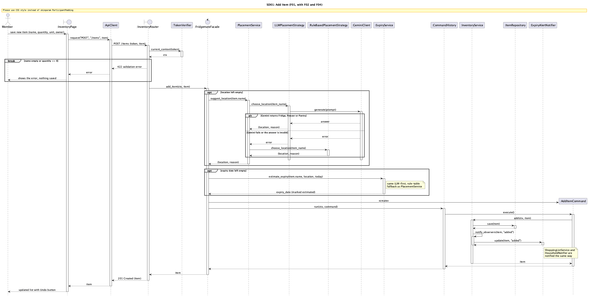

The member saves a new item, and the request passes the token check before reaching the facade. If the location or expiry date is empty, the facade asks `PlacementService` and `ExpiryService`, which try Gemini first and fall back to the rule table if it fails. The item is then saved through an `AddItemCommand` so it can be undone, and `InventoryService` notifies its observers. Invalid input stops the flow early with an error.

#### SD02: Import Receipt

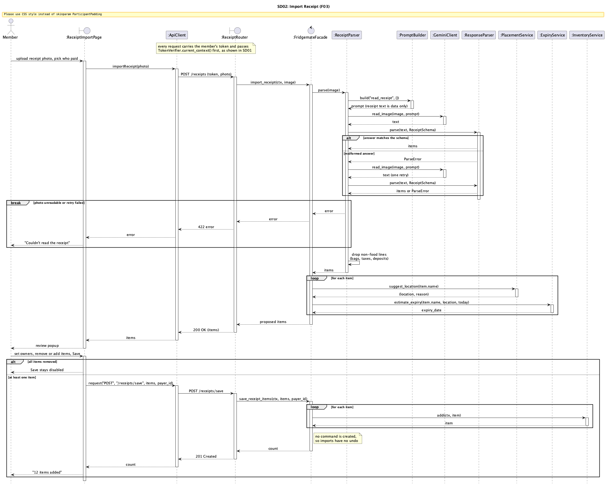

`ReceiptParser` sends the photo to Gemini and checks the answer with `ResponseParser`, retrying once if the format is wrong. Each item then gets a location and expiry estimate, and the member reviews everything in the popup. Saving adds the items directly through `InventoryService`, without a command, so imports have no undo.

#### SD03: Refresh Freshness and Show Alerts

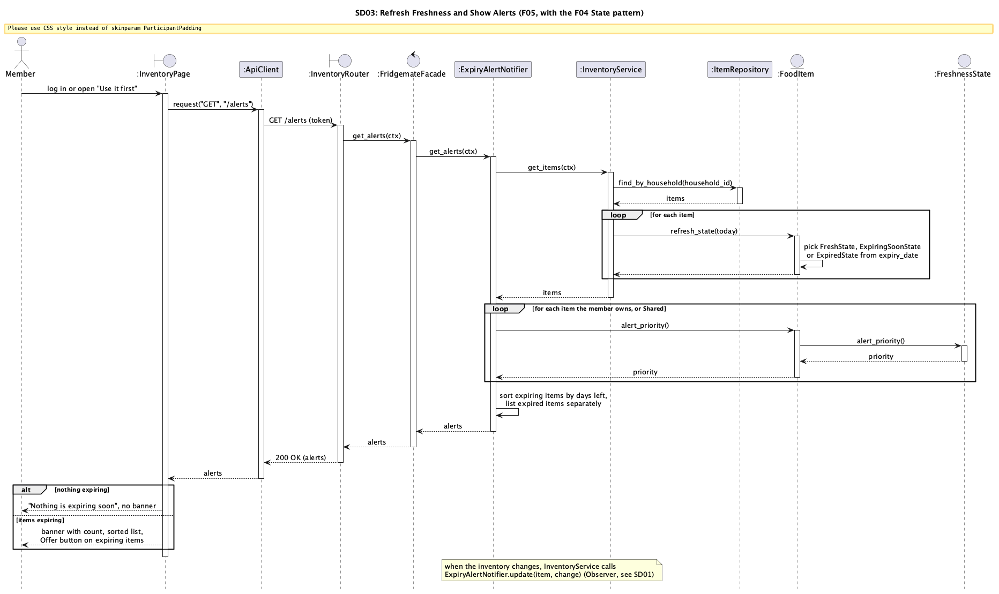

Each time items are loaded, every `FoodItem` picks its freshness state from its expiry date. `ExpiryAlertNotifier` then asks each item for its alert priority, and the item hands the question to its current `FreshnessState`. This is the State pattern at work.

#### SD04: Suggest Recipes

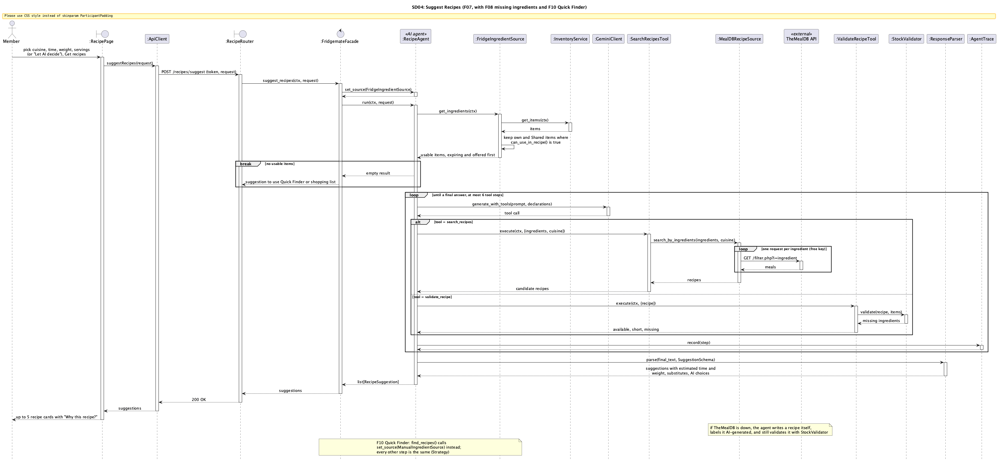

The facade gives `RecipeAgent` a `FridgeIngredientSource`, which removes roommates' and expired items before the AI sees anything. The agent then loops, up to 6 tool steps: Gemini picks a tool, the agent runs it, and every step is recorded for the "Why this recipe?" panel. `SearchRecipesTool` queries TheMealDB one ingredient at a time, and `ValidateRecipeTool` checks each recipe against the real stock. For F10, the only difference is a `ManualIngredientSource`.

#### SD05: Cook Recipe and Undo

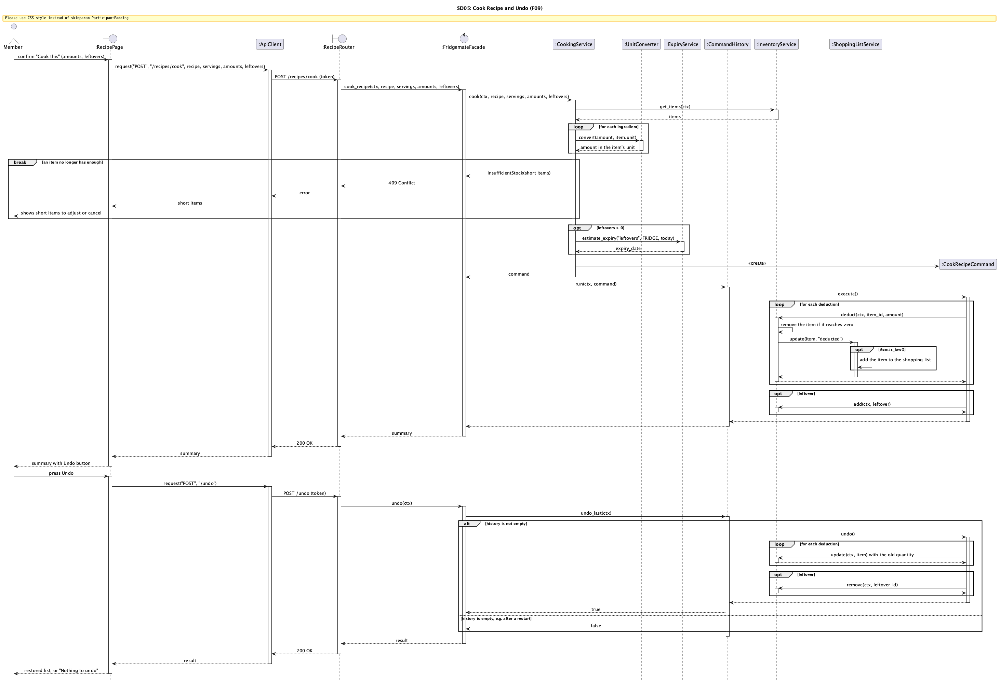

`CookingService` converts units, checks there's enough stock, and creates a `CookRecipeCommand`. Running it deducts each ingredient, and `ShoppingListService` adds any item that runs low. Pressing Undo calls `undo_last()`, which restores every quantity and removes the leftovers.

#### SD06: Build Shopping List

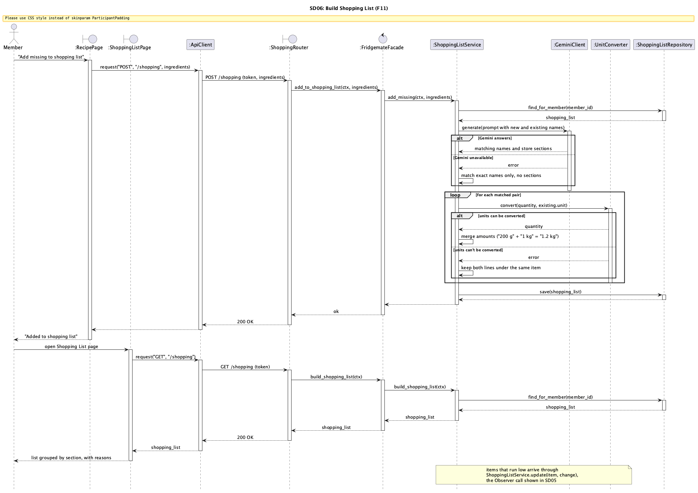

Missing ingredients from a recipe are added to the member's list. Gemini matches names that mean the same thing and picks store sections, and `UnitConverter` merges amounts. If Gemini is unavailable, only exact names are merged.

#### SD07: Run Fridge Command

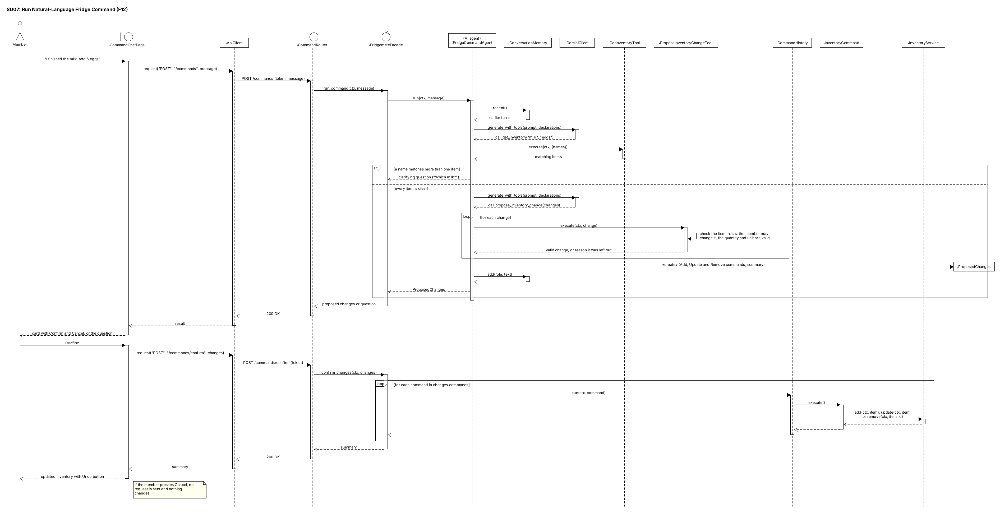

`FridgeCommandAgent` reads the recent conversation, looks up the items the message mentions, and asks a follow-up question if a name is unclear. Otherwise, `ProposeInventoryChangeTool` checks each change, and the agent builds a `ProposedChanges` object. Nothing changes until the member confirms; then each command runs through `CommandHistory`.

#### SD08: Plan Waste-Rescue Meals

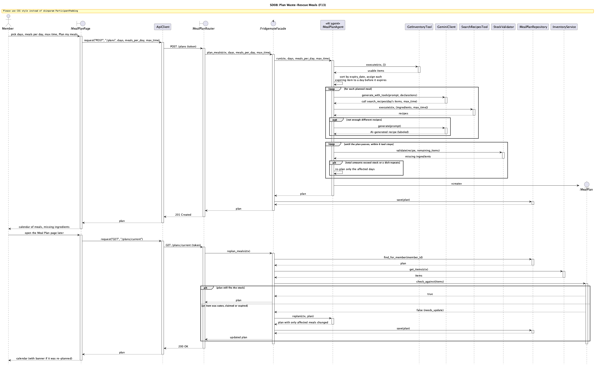

`MealPlanAgent` assigns each expiring item to a day, finds recipes for each meal, and checks the whole plan with `StockValidator`, re-planning any day that fails. The facade saves the plan. When the member opens it later, `MealPlan.check_against()` checks it against the current stock, and only the affected meals are re-planned.

#### SD09: Split Shared Costs

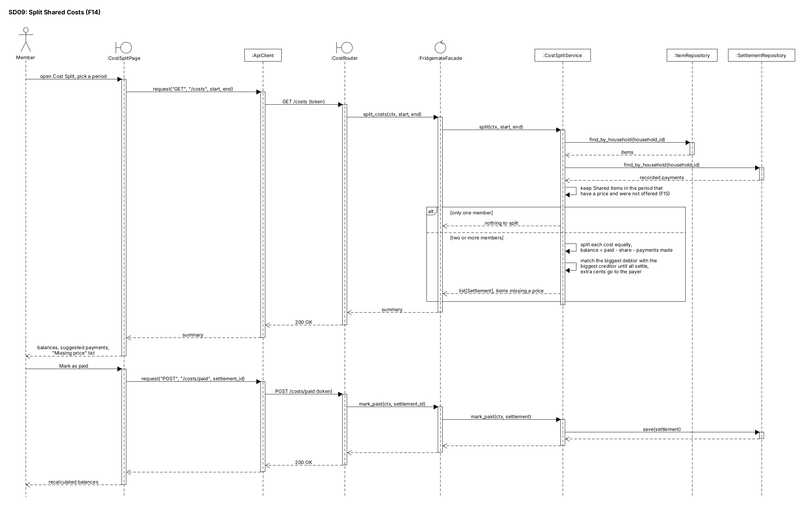

`CostSplitService` loads the household's items and recorded payments, keeps Shared items with a price, and works out balances and the fewest payments. Marking a payment as paid saves it and recalculates.

#### SD10: Offer and Claim an Expiring Item

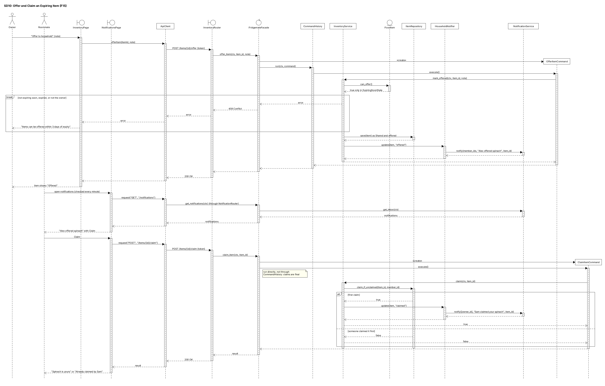

The owner's offer runs as an `OfferItemCommand`, which checks `can_offer()` so only items in the Expiring soon state can be offered. `HouseholdNotifier` then notifies the other members. A roommate's claim runs as a `ClaimItemCommand` outside the undo history, and `claim_if_unclaimed()` makes sure only the first claim wins.

#### SD11: Log In and Set Up Profile and Household

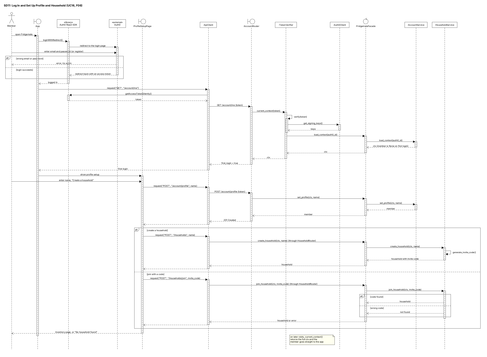

Auth0 handles the login page, so Fridgemate never sees the password. `TokenVerifier` checks the token with Auth0's signing keys and asks the facade to load the member. On first login, the member enters their name, then creates a household or joins one with an invite code.
